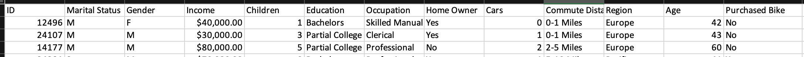
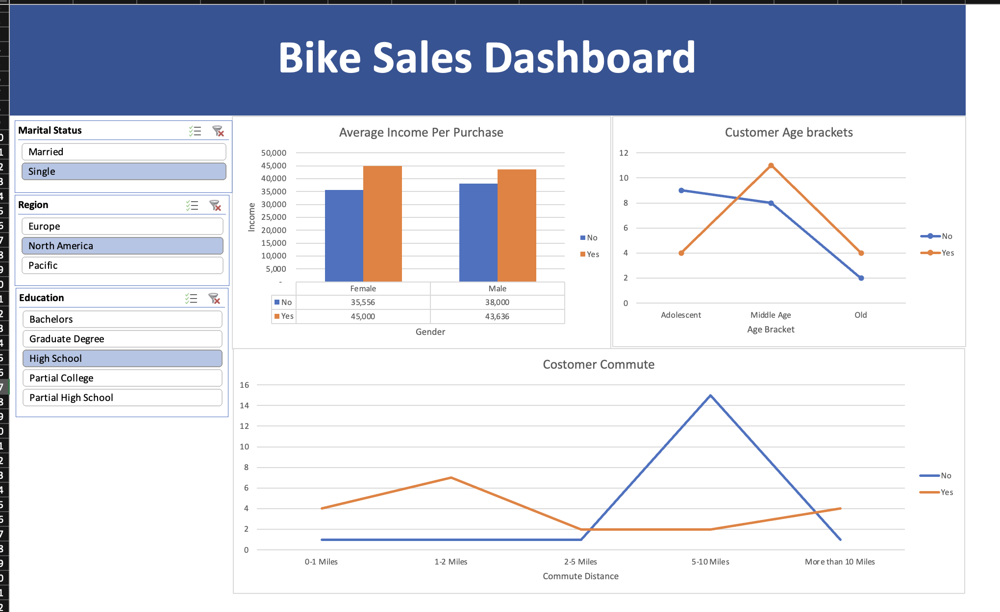

# Bike-Sales-Data-Analysis-Dashboard

This project demonstrates my skills in data cleaning, analysis, and visualization using Microsoft Excel. I analyzed bike sales data to uncover trends and insights, and created an interactive dashboard to summarize the findings.

## Project Overview

The goal of this project was to:

*  Clean the raw dataset: Handle missing values, correct inconsistencies, and format the data for analysis.
*  Analyze the data: Use pivot tables to generate meaningful summaries and metrics.
*  Visualize key insights: Build an interactive dashboard to showcase trends such as:
    * Income differences based on gender and purchase behavior.
    * Age brackets and their impact on bike purchases.
    * Commute distance and its correlation with bike purchases.
      
## Skills Demonstrated

* Data Cleaning:
    * Identified and corrected inconsistencies in income and categorical data.
    * Reformatted data for better readability and usability.
* Pivot Tables:
    * Summarized data by marital status, gender, region, education, and purchase behavior.
* Data Visualization:
    * Created charts to display average income, customer age brackets, and commute distances.
    * Designed an intuitive dashboard layout for easy navigation and insight derivation.
 
## Key Features of the Dashboard

* Dynamic Filters:
    * Filters for marital status, region, and education to customize the view.
* Charts:
    * Average Income Per Purchase: A comparison by gender and purchase status.
    * Customer Age Brackets: Age-wise segmentation of bike purchases.
    * Commute Distance: Patterns of bike purchases by commute distance.
 
## Dataset Details

The dataset includes information about customer demographics, income, commute distance, and whether they purchased a bike. Below is a snapshot of the dataset:



## Tools Used

* Microsoft Excel:
    * Data cleaning and preprocessing.
    * Creation of pivot tables for analysis.
    * Interactive dashboard development.
* Skills Highlighted:
    * Data visualization
    * Analytical problem-solving
    * Attention to detail

## Dashboard Preview



## How to Access the Project

* Clone the repository:
```
git clone https://github.com/Dexter135790/Bike-Sales-Data-Analysis-Dashboard
```
* Open the Excel file in Microsoft Excel to interact with the dashboard.

## Future Enhancements

* Automating data cleaning with Python or Power Query.
* Integrating the dashboard with real-time data updates.
* Expanding analysis to include additional metrics like seasonal trends.

## Conclusion

This project highlights my ability to analyze data and present actionable insights through interactive dashboards.


